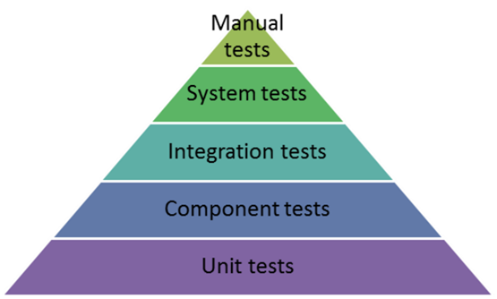

# Szoftvertesztelés jegyzet

[Tárgyleírás](szoftvertesztelés-tárgyleírás.md)

## Unit tesztelés gyakorlatban

### .NET-es környezetben

Javasolt könyvtár a .NET-es egységtesztek készítésére az NUnit.

#### NUnit tesztkörnyezet kialakítása

1. Solution belül egy NUnit projekt hozzáadása.
2. A Solution Exploreren belül a tesztprojekt Dependency-s bejegyzésére jobb klikk => add project references.
    - Add hozzá azokat a projekt referenciákat amiket tesztelnél.
    - **Figyelem**: Ahhoz, hogy elérd a tesztprojektedből a tesztelendő kódokat, publikusnak kell definiálnod amit el szeretnél érni. (pl.: egy metódus esetében public osztályon belül public metódus)

## Szakkifejezések

### Tesztpiramis

A tesztpiramis egy módszer a tesztelési stratégia szervezésére, ahol a különböző tesztszintek (pl. unit tesztek, integrációs tesztek, rendszer tesztek, stb.) hierarchikusan helyezkednek el, ahol a legtöbb idő és figyelem az alapját képező unit tesztekre fordítják, míg a magasabb szintű tesztek kevesebb figyelmet kapnak.

### Egységteszt (Unit test)

Az egységteszt olyan tesztelési módszer, amely során a szoftver kisebb egységei (általában függvények vagy osztályok) funkcionalitását tesztelik. Az egységtesztek arra szolgálnak, hogy ellenőrizzék, hogy az egyes egységek a kívánt módon működnek-e, és segítenek az esetleges hibák korai felfedezésében.

### Integrációs teszt

Az integrációs teszt a szoftverfejlesztési folyamat során végrehajtott tesztelési szint, amely során az egyes kódmodulokat vagy komponenseket összekapcsolják és ellenőrzik, hogy az integráció során nem keletkeznek hibák. Az integrációs tesztek célja az egyes komponensek közötti kommunikáció és együttműködés ellenőrzése.

### Rendszer teszt

A rendszer teszt a szoftver tesztelési szintje, amely során a teljes rendszer funkcionalitását és teljesítményét tesztelik. Ebben a fázisban a teljes szoftveralkalmazást tesztelik, és ellenőrzik, hogy az az elvárásoknak megfelel-e.

A rendszer teszt során a szoftvert mint egészet tesztelik, és a rendszer határai meghatározóak a tesztelési folyamatban. A rendszer határai meghatározzák, hogy mely részeket tartalmazza a tesztelt szoftver és melyeket nem.

A rendszer határai általában a következőket tartalmazzák:

1. A szoftver alkalmazás teljes funkcionalitása: A rendszer tesztelése során az összes funkcionalitást tesztelik, amely a szoftveralkalmazáshoz tartozik. Ez magában foglalja az összes modult, funkciót és szolgáltatást, amelyek a szoftverhez tartoznak.

2. A szoftver interfészei és kommunikációja: A rendszer határai tartalmazzák az interfészeket, amelyeken keresztül a szoftver kommunikál más rendszerekkel vagy komponensekkel. Az interfészek ellenőrzése és tesztelése kulcsfontosságú a rendszer megfelelő működéséhez.

3. Az adatbázisok és adattárolás: Ha a szoftver adatbázisokkal vagy adattárolással dolgozik, akkor ezek is a rendszer határain belül vannak, és az adattárolás helyes működése is ellenőrzésre kerül.

4. A rendszerkörnyezet: A rendszer tesztelése során az alkalmazás működési környezete, például a szerverek, hálózati kapcsolatok, operációs rendszer és egyéb környezeti tényezők is a rendszer határain belül vannak.

A rendszer teszt során ezeket a határokat figyelembe veszik, és az ellenőrzött funkcionalitás és a környezeti tényezők együttesen meghatározzák, hogy a szoftver az elvárásoknak megfelel-e, és megfelelően működik-e. A rendszer tesztelése a szoftver teljesítményének és funkcionalitásának végső ellenőrzése, mielőtt azt éles környezetben használnák.

### Átvételi teszt

### Szoftver életciklus

### Szoftverfejlesztési módszertan

### V-modell

### Protopítus modell

### Iteratív módszertanok

### Inkrementális módszertanok

### RAD (Rapid Application Development)

### Agilis szoftverfejlesztés

### Scrum

### ILT (Integration Level Testing)

### SLT (System Level Testing)

### UAT (User Acceptance Testing)

### Biztonsági tesztelés

### Teljesítmény és terhelésteszt

### TDD (Test Driven Development)